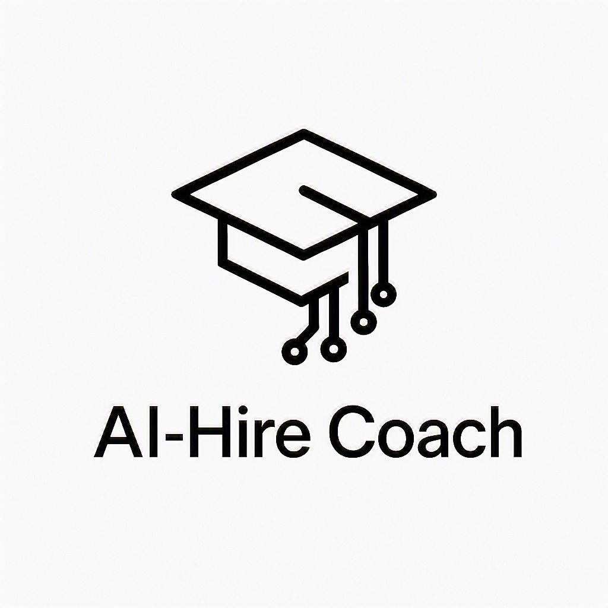
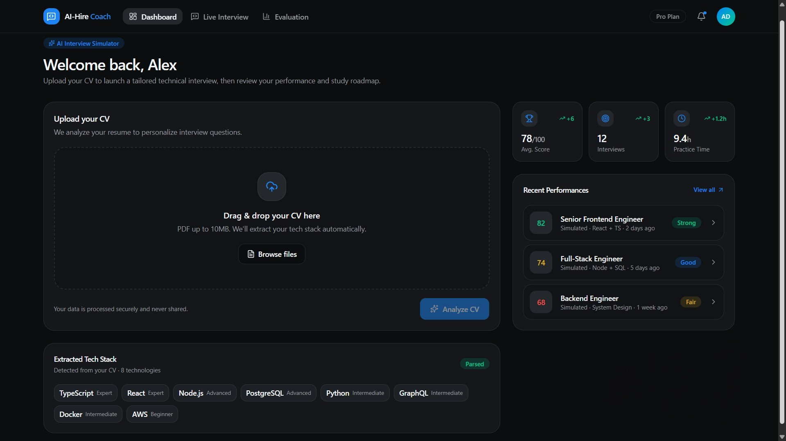
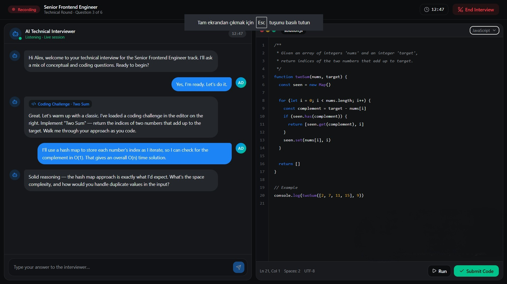
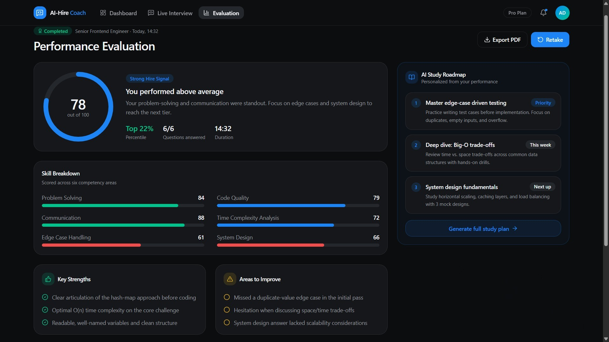
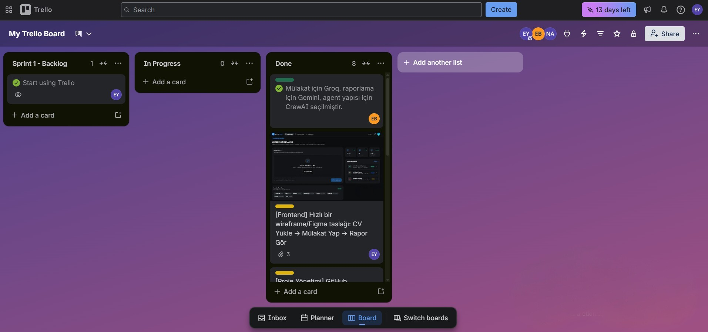

<html>
<body>

  

<h1 align="center"><b>AI-Hire Coach</b></h1>

<h3>🎯 What is the Project?</h3>
We analyze the PDF CV uploaded by the user using local NLP processes to extract their skills (tech stack, years of experience, etc.). Then, through AI agents configured with LangChain/CrewAI, we conduct a personalized, interactive technical interview simulation based on this information. At the end of the interview, the Evaluation Agent scores the candidate and provides a report outlining their deficiencies and development suggestions.

---

## Multi-Agent Architecture & System Roles

Our project operates with 3 core AI agents, each specialized in distinct domains and working in full coordination:

1. **CV Analyzer Agent**
   * **System Role:** Information Extraction & Profiling Specialist
   * **LLM Used:** Gemini 1.5 Flash (Chosen for its large context window and high data comprehension)
   * **Input/Output:** Raw text extracted via `pdfplumber` ➡️ Competency Matrix (Tech stack, years of experience, seniority detection).
   * **Task Description:** Reads the raw text parsed from the local processor. Verifies the candidate's software development level (e.g., Junior/Entry-Level). Categorizes the technologies mentioned in the resume and structures a preliminary report to pass strengths and potential growth areas to the interviewer agent.

2. **Technical Interviewer Agent**
   * **System Role:** Live Chat & Question Simulator
   * **LLM Used:** Groq / Llama 3 (Chosen for ultra-low latency, response speed, and fluid conversation flow)
   * **Input/Output:** Analyzer Agent's report + Candidate's real-time responses + Chat history ➡️ Interactive, concise, and laser-focused technical interview questions.
   * **Task Description:** Initiates the interview based on the candidate's profile. Instead of asking theoretical memorization questions, it presents scenario-based and logic-driven questions related to the technologies used in the candidate's projects. It analyzes each answer; if an answer is incomplete, it drills deeper, and if correct, it smoothly transitions to the next topic, keeping responses short and limited to one question at a time.

3. **Performance Evaluator Agent**
   * **System Role:** HR Reporting & Analytics Expert
   * **LLM Used:** Gemini 1.5 Flash (Chosen to digest and process the entire conversation log in a single execution)
   * **Input/Output:** Cumulative Chat logs accumulated throughout the interview ➡️ Markdown/JSON candidate scorecard (Scoring & Development Roadmap).
   * **Task Description:** Conducts a deep-dive analysis of the entire dialogue history generated from start to finish. Evaluates the accuracy, technical depth, and problem-solving approaches of the candidate's answers. Scores the candidate out of 100 and generates a professional HR report detailing areas of excellence and absolute developmental needs.

---
## 👥 Team Members

<table width="100%" align="center">
  <tr>
    <th>Avatar</th>
    <th>Name</th>
    <th>Title / Role</th>
    <th>Socials</th>
  </tr>
  <tr>
    <td></td>
    <td><b>Esma Yıldız</b></td>
    <td>Scrum Master</td>
    <td>
      
      
    </td>
  </tr>
  <tr>
    <td></td>
    <td><b>Nur Sima Akgül</b></td>
    <td>Product Owner</td>
    <td>
      
      
    </td>
  </tr>
  <tr>
    <td></td>
    <td><b>Esra Bayrakcı</b></td>
    <td>Developer</td>
    <td>
      
      
    </td>
  </tr>
</table>

---

<h1 align="center">SPRINTS</h1>

  
<b>Sprint 1</b>

  ### 📌 Sprint Goals
  Our primary goal in this sprint is to define the architectural outline of the project, finalize technology selections, and set up the development environments (individual local installations and the shared repository).

  ### Backlog Structure & Story Selection
  As the initial phase of the project, the Product Backlog was established, and the first sprint was designated as the "Research, Selection, and Architecture Boilerplate" phase. User Stories were selected and prioritized using Story Points (SP):
  * **Story 1 (Technology & Framework Selections):** As a Scrum Master/Developer, I want to finalize the project's LLM and Agent orchestration infrastructure (LangChain vs. CrewAI, Groq vs. Gemini) so that we can transition into the development phase with alignment. *(Estimation: 3 SP)*
  * **Story 2 (Database Design & Memory Planning):** As a Product Owner, I want to design a relational DB schema to store conversation logs efficiently to optimize free API token limits. *(Estimation: 5 SP)*
  * **Story 3 (UI Mockups & Wireframes):** As a user, I want to see a wireframe layout of the screens to comprehend the end-to-end interview simulation flow. *(Estimation: 5 SP)*

  ### Daily Scrum
  Throughout the planning week, the team conducted sync meetings twice a week over Slack to maintain alignment and address ongoing tasks.
  * **Key Discussion & Blocker Resolution:** The major architectural debate centered on leveraging **Groq/Llama 3** for the Interviewer Agent to ensure ultra-low latency response times, while utilizing **Gemini 1.5 Flash** for CV Analysis and Performance Evaluation due to its massive context window. Slack evaluations concluded with a consensus on this hybrid model.

  ### Sprint Tasks & Status Table

  | Field of Work | Task | Assignee | Status |
  | :--- | :--- | :--- | :--- |
  | **Project Management** | Finalizing technology selections, setting up the Repo and Scrum Board | Esma Yıldız | ✅ Done |
  | **CV Analysis & NLP** | Selecting a library for PDF text extraction (pdfplumber/PyMuPDF) and initial trials | Esra Bayrakcı | ✅ Done |
  | **Multi-Agent** | Designing agent roles on paper and creating a basic architectural drawing | Esra Bayrakcı | ✅ Done |
  | **Backend API** | Setting up the boilerplate structure of the FastAPI project, folder layout, and `.env` configuration | Esra Bayrakcı | ✅ Done |
  | **Database & Memory** | Table schema design (User, Session, Message, Report) and DB selection | Nur Sima Akgül | ✅ Done |
  | **Frontend** | Preparing a quick wireframe/Figma draft | Esma Yıldız | ✅ Done |
  | **DevOps** | Researching free hosting options (Render, Railway, HF) | Esma Yıldız | ✅ Done |

 

<h3>Sprint 1 - Web Site Screenshots</h3>

 

<h4>Dashboard & CV Upload Screen</h4>

  

<h4>Dynamic Technical Interview Screen (Split View)</h4>

  

<h4>AI Performance Evaluation & Study Roadmap Screen</h4>

  

    
<h3>Sprint 1 - Trello Screenshots</h3>

    
  

### Sprint Notes:
* It has been decided to use `Trello` for project management.
* It has been agreed to use `V0.app` for UI designs and wireframes.
* `FastAPI` has been deemed appropriate for the backend architecture and will be deployed using `Render`.
* It has been decided to test `pdfplumber` or `PyMuPDF` libraries for PDF text extraction in NLP processes.
* `Render` and `Hugging Face Spaces` platforms have been prioritized as free hosting solutions.
* User interfaces will be developed using `React.js` as the frontend technology and deployed with `Vercel`.
* It has been decided to use `Redux Toolkit` on the React side to manage data such as interview history, user information, and agent responses efficiently without complexity.

### Sprint Review
At the conclusion of Sprint 1, all theoretical foundations of the project were successfully finalized. The structural roles of the Multi-Agent system were defined, FastAPI and React directory structures were initiated, and the required software libraries (pdfplumber, Redux Toolkit, Monaco Editor) were locked down. Frontend wireframes generated via V0.app were approved by the Product Owner and marked as "Ready for Dev."

### Sprint Retro
* **What Went Well:** Team role allocation (PO, Scrum Master, Developer) was incredibly swift. Breaking down LLM assignments by utility (Groq for speed, Gemini for context width) secured our project's cost/performance efficiency early on.
* **What Can Be Improved:** We spent a bit too much time researching the nuances of free hosting alternatives (Render, Hugging Face) and cold start limitations. The next sprint must focus entirely on functional coding.
* **Action Plan:** Moving into Sprint 2, we will instantly stand up our designed database schemas (User, Session, Message) on PostgreSQL and simultaneously kick off our core `pdfplumber` pipeline integrations.

  

<!--

<b>Sprint 2</b>

 
<i>Bu sprint henüz başlamadı.</i>

<b>🔒 Sprint 3</b>

 
<i>Bu sprint henüz başlamadı.</i>

<b>🔒 Sprint 4</b>

 
<i>Bu sprint henüz başlamadı.</i>

<b>🔒 Sprint 5</b>

 
<i>Bu sprint henüz başlamadı.</i>

<b>🔒 Sprint 6</b>

 
<i>Bu sprint henüz başlamadı.</i>

---
## 🎨 Brand Color Reference (Core Dark Theme)

| Theme Component | Hex | Visual Preview |
| :--- | :--- | :--- |
| Primary Accent (Buttons & Active) | `#A855F7` |  |
| Secondary Accent (Highlights) | `#06B6D4` |  |
| Deep Background (Dark Slate) | `#0B0F19` |  |

---

## 🛠️ Selected Technologies & Core Libraries
- [x] `FastAPI` (High-performance Python Web Framework)
- [x] `LangChain` / `CrewAI` (Multi-Agent AI Orchestration)
- [x] `React.js` (Frontend UI Engine)
- [x] `Redux Toolkit` (Predictable Global State Container)
- [x] `@monaco-editor/react` (Embedded Live Code Editor)
- [x] `pdfplumber` (Local NLP Resume Data Extraction)
-->
</body>
</html>

